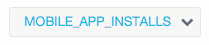
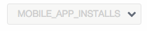
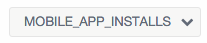

# Basic Component

## ::basicButton  
#### Module Name
commonApp.basicBtn

#### 參數說明
* draft: 指定常用的按鈕樣式，會自動套入預設的 color 和 text
* color: 按鈕顏色
* text: 顯示文字
* fa: 按鈕圖示的 class
 
#### draft
prev / next / cancel / submit / icon-create / icon-delete / icon-copy / icon-edit / icon-sync

#### color
gray(default) / green / purple

#### fa
https://fortawesome.github.io/Font-Awesome/icons/

#### disabled
true / false
   
#### 使用範例
    
```
basic-btn(draft="prev")
basic-btn(draft="next")
basic-btn(draft="cancel")
basic-btn(draft="submit")
basic-btn(draft="icon-create")
basic-btn(draft="icon-delete")
basic-btn(draft="icon-copy")
basic-btn(draft="icon-edit")
basic-btn(draft="icon-sync")
basic-btn(color="purple", text="Home", fa="fa-home fa-fw")
basic-btn(color="purple", text="Home", fa="fa-home fa-fw", ng-disabled="true")
basic-btn(color="green", fa="fa-refresh")
basic-btn(color="green", fa="fa-refresh", ng-disabled="true")
```
   
  
## ::basicCheckbox
#### Module Name
common.basicCheckbox


#### 參數說明
* checkboxData(required): 元件要顯示的內容陣列
* checkboxModel(required): 元件被選取後要綁定的 scope 變數
* checkboxChange:元件變更選取項目時要觸發的 function
* checkboxDisabled: 將此元件變更爲不可選取狀態

#### checkboxData
{ text:"要顯示的文字", value: "點選後的值" }

#### checkboxDisabled
true / false

#### 使用範例

```
$scope.allFoodsCheckedData = {text: "SelectAll", value: "allFoodsChecked"}

$scope.allFoodsCheckedModel = {
  allFoodsChecked: false
}

$scope.foodCheckboxDataList = [
  {text: "Noodle", value: "noodle"},
  {text: "Rice", value: "rice"},
  {text: "Hamburger", value: "hamburger"}
  {text: "Chicken", value: "chicken", disabled: true}
  {text: "Beef", value: "beef", disabled: true}
]

$scope.selectedFoods = {
  noodle: false
  rice: true
  hamburger: false
  chicken: false
  beef: true
}

$scope.selectAllCheckbox = ->
  if $scope.allFoodsCheckedModel.allFoodsChecked
    _.forEach($scope.selectedFoods, (val, key) ->
      $scope.selectedFoods[key] = true
      return
    )
    return

  _.forEach($scope.selectedFoods, (val, key) ->
    $scope.selectedFoods[key] = false
    return
  )
  return

$scope.ifAllFoodsChecked = ->
  $scope.allFoodsCheckedModel.allFoodsChecked = true
  _.forEach($scope.selectedFoods, (val) ->
    unless val
      $scope.allFoodsCheckedModel.allFoodsChecked = false
      return false
    return true
  )
  return


$scope.changeCheckbox = (item) ->
  $scope.ifAllFoodsChecked()
  console.log "checked item=", item
  return

$scope.ifAllFoodsChecked()
```
```
| Food:
div
  basic-checkbox#selectAllFoods(checkbox-data="allFoodsCheckedData" checkbox-model="allFoodsCheckedModel"  checkbox-change="selectAllCheckbox()")
  div
    span(ng-repeat="foodCheckboxData in foodCheckboxDataList" style="margin-left:10px")
      basic-checkbox(checkbox-data="foodCheckboxData" checkbox-model="selectedFoods" checkbox-change="changeCheckbox(item)", checkbox-disabled="foodCheckboxData.disabled")
  div
  | {{selectedFoods}}
``` 
   
   
## ::basicInput
#### Module Name
commonApp.basicInput

#### 參數說明
* noticeDom: 想要設為 [notice 訊息 DOM] 的搜尋(.find())條件

#### noticeDom 參數
* noticeColor: "red" / "green" 要顯示的訊息顏色，預設為無(黑色)
   
#### 使用範例

```
form(name="fridayForm" novalidate=)
  basic-input(type="text" name="name" placeholder="Please insert your name"
  ng-model="basicInput.name" notice-dom="#notice1, #notice2"
  ng-minlength="3" required)

  #notice1(notice-color ="red" ng-show="fridayForm.name.$error.required") Can not be empty
  #notice2(notice-color ="green" ng-show="fridayForm.name.$error.minlength") Min-length must >= 3

  basic-input(type="text" name="phone" placeholder="Please insert your phone"
  ng-model="basicInput.phone" notice-dom="#notice3, #notice4"
  ng-minlength="7" required)

  #notice3 This is normal notice
  #notice4(notice-color ="green" ng-show="fridayForm.phone.$error.minlength") Min-length must >= 7

  basic-input(tag-name="textarea" name="address" placeholder="Please insert your address"
  width="68%" height="100px"
  ng-model="basicInput.address")

| {{basicInput}}
```   
   
   
## ::basicRadio
#### Module Name
commonApp.basicRadio

#### 參數說明
* radioData(required): 元件要顯示的內容陣列
* name(required): 元件名稱(要設定才能讓 radio 裡的項目綁定為一組)
* radioModel: 元件被選取後要綁定的 scope 變數
* radioChange: 元件變更選取項目時要觸發的 function
* radioDisabled: 將此元件變更爲不可選取狀態

#### radioData
{ text:"要顯示的文字", value: "點選後的值" }

#### radioDisabled
true / false

#### 使用範例
```
$scope.changeRadio = (item) ->
  console.log "selected item=", item
  console.log "$scope.target=", $scope.target
  return
  
$scope.sexRadioDataList = [
  {text: "Man", value: "man"},
  {text: "Woman", value: "woman"},
]

$scope.ageRadioDataList = [
  {text: "<12", value: "12"},
  {text: "<20", value: "19"},
  {text: ">=20", value: "20"}
]

$scope.petRadioDataList = [
  {text: "Dog", value: "dog"},
  {text: "Cat", value: "cat", disabled: true},
]

$scope.target = {
  sex: "man"
  age: "12"
  pet: ""
}

$scope.disabledAll = true
```
```
div
  | Sex:
  div(ng-repeat="sexRadioData in sexRadioDataList")
    basic-radio(name="sex", radio-data="sexRadioData", radio-change="changeRadio(item)", radio-model="target.sex")
  | Age:
    div(ng-repeat="ageRadioData in ageRadioDataList")
    basic-radio(name="age", radio-data="ageRadioData", radio-model="target.age")
  | Pet:
    div(ng-repeat="petRadioData in petRadioDataList")
    basic-radio(name="pet", radio-data="petRadioData", radio-change="changeRadio(item)", radio-model="target.pet", radio-disabled="petRadioData.disabled")
```
   
   
# 待更新

## ::pmdDropdown  
#### Module Name
common.pmdDropdown


#### 參數說明
* items(required): Dropdown Items，項目不可重複 (Array)
* selected-osition(required): 目前選擇項目的位置 (String)
* status: dropdown 的狀態(default, disabled, locked)，default is "default"
	* default:  
	  
	* disabled:  
	  
	* locked:  
	  
* pmd-change: 使用者點選後觸發的動作 (Function)
* defalut-position: 預設顯示的項目 (Int)， default is 0
* disabled: 是否要停用這個物件，default is false
   
#### 使用範例
`pmd-dropdown(status="default" items="trafficValueArgs", defalut-position="0", selected-position="trafficTypePosition" pmd-change="selectedWebsiteTraffic(trafficArgs[trafficTypePosition], trafficTypePosition)")`
