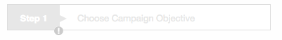

# Step Widget Spec
### 用法
`step(step-title="titleData" disabled="stepDisabled" edit-click="stepClick()" is-finish="stepStatus" item-list="itemList")`

### 所需參數及格式
* step-title：傳入步驟的順序及標題

		titleData = {
			number: 1
			text: "Choose Campaign Objective"
		}

* edit-click：傳入點擊編輯按鈕後會執行的函式  
	

* disabled：控制 step 的狀態，值為 Boolean  
	**true**  
	  
	**false**  
	

* is-finish：控制 step warn icon 的狀態，值為 Boolean  
	**true**  
	   
	**false**  
	  
	
* item-list：傳入下方所需顯示的資料  
	
		itemList = [
			{
				title: "list 1",
				message: "Test"
			}, {
				title: "list 2",
				message: "sss"
			}
		]