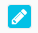
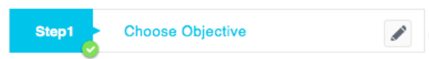
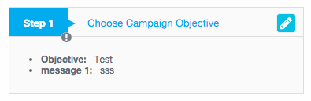
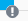

# Step Widget Spec
### 用法
	step(status="steptype" which-step="{{titleData.number}}" step-title="{titleData.text}" disabled="stepDisabled" edit-click="stepClick()" is-finish="stepStatus")
		p "include in step"

### 所需參數及格式
* which-step：傳入 step 的前綴詞(藍色框內)

* step-title：傳入 step title 的字串(灰色框內)

* edit-click：傳入點擊編輯按鈕後會執行的函式  
	

* disabled：控制 step 的狀態，將會無法點擊，值為 Boolean  
	**true**  
	  
	**false**  
	

* is-finish：控制 step warn icon 的狀態，值為 Boolean  
	**true**  
	   
	**false**  
	  
	
* status：控制 step 的 UI 顯示狀態，值為 inactive, active, edit
	* active：僅僅觀看此步驟資訊  
		
	* inactive：還未進入過此步驟  
		
	* edit：正在此步驟時  
		
		
### Step block
Step title 下方的所顯示的內容只要寫下 step directive 底下即可，如下方範例的`p`

     step(status="steptype" which-step="{{titleData.number}}" step-title="{titleData.text}" disabled="stepDisabled" edit-click="stepClick()" is-finish="stepStatus")
        p sdfsd